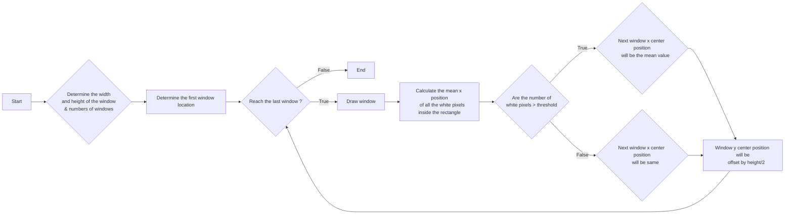

```mermaid
flowchart LR
    A[Start] --> B{Determine the width
     and height of the window
      & numbers of windows}
    B --> C[Determine the first window location]
    C -->D{Reach the last window ?}
    D -->|False| E[End]
    D -->|True| F[Draw window]
    F --> G[Calculate the mean x position
     of all the white pixels inside the rectangle]
    G --> H{Are the number of 
    white pixels > threshold}
    H --> |True|I{Next window x center position
     will be the mean value}
    H --> |False|K{Next window x center position
     will be same}
    I & K-->L[Window y center position will be
     offset by height/2]
    L --> D
```